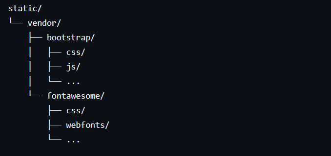

Community Fund System

A Community Fund System is a platform inspired by a ROSCA (Rotating Savings and Credit Association).

Members of a community contribute a fixed amount of money on a regular basis (daily, weekly, or monthly). The total collected amount is then given to one member at a time based on an agreed rotation, until all members have received their share. This system helps communities save collectively, support one another, and access lump sums without relying on banks.

This project digitizes the ROSCA process by providing:

Member management

Contribution tracking

Fund rotation handling

Transparency within the group

The system is built using PHP with simple frontend tools to keep it lightweight and easy to deploy.

Frontend Assets (Bootstrap & Font Awesome)

All frontend assets must be added manually.

Required Libraries

Bootstrap – for layout and styling

Font Awesome – for icons and fonts

Download the libraries and place them in the following locations:

Installation Steps

Download Bootstrap from
https://getbootstrap.com/

Download Font Awesome from
https://fontawesome.com/

Extract both archives into the static/vendor/ directory as shown above.
